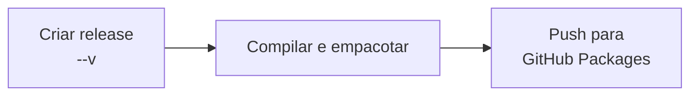
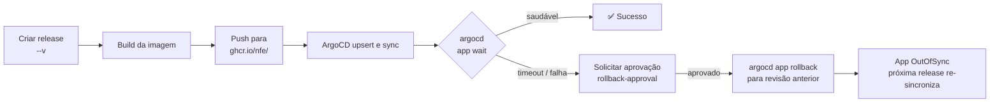
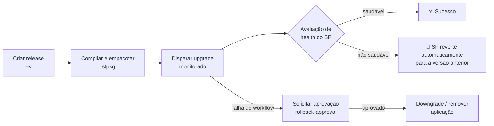

# 📘 Convenções para repositórios de produção

Aplica-se a qualquer repositório da organização `nfe` cujos artefatos vão para produção — contêineres implantados via ArgoCD, pacotes NuGet publicados no GitHub Packages ou aplicações Service Fabric. Adote estas convenções ao criar um novo repositório de produção ou ao migrar um existente.

---

# Todos os repositórios de produção

## 1. 🏷️ Tags e versionamento

- **Prefixo da tag de release**: `<produto>-<tipo>-v<semver>` (ex.: `xml2pdf-api-v1.2.0`, `nfse-worker-v3.4.1`). `<tipo>` é o papel do artefato — `api`, `worker`, `job`, `app`, etc. Sempre — mesmo quando o repositório entrega apenas um artefato. `v<semver>` sem prefixo **não** é usado; o prefixo mantém repositórios com múltiplos artefatos sem ambiguidade e acomoda novos artefatos no futuro sem renomeação disruptiva.
- **Somente SemVer** — `MAJOR.MINOR.PATCH`. Os workflows reutilizáveis rejeitam tags fora do padrão SemVer.
- **A versão do artefato é derivada da tag** — nunca fixada no código-fonte.

## 2. 📁 Layout do repositório

| Caminho | Propósito |
|---|---|
| `Dockerfile` | Um por aplicação implantável; multi-stage (ver §4) |
| `kubernetes/values-<stage>.yaml` | Valores Helm por stage (trilha de contêiner) |
| `.github/workflows/pr.yml` | Validação de PR |
| `.github/workflows/publish-*.yml` | Publicação disparada por release, um arquivo por prefixo de tag |

## 3. ⚙️ Workflows reutilizáveis

Todos os workflows reutilizáveis compartilhados ficam em `nfe/.github/.github/workflows/`. Os callers devem ser wrappers finos — sem lógica além da passagem de inputs e do gate de prefixo de release `if: startsWith(github.event.release.tag_name, '<produto>-<tipo>-v')`. Consulte cada arquivo para a superfície completa de inputs/secrets.

| Workflow | Propósito |
|---|---|
| 🐳 [`build-and-push-container.yml`](https://github.com/nfe/.github/blob/main/.github/workflows/build-and-push-container.yml) | Constrói uma imagem de contêiner e faz push para o GHCR; expõe a versão extraída para jobs subsequentes. |
| 🚀 [`publish-container-argocd.yml`](https://github.com/nfe/.github/blob/main/.github/workflows/publish-container-argocd.yml) | Faz upsert da aplicação ArgoCD com uma tag de imagem específica, aguarda sync saudável e controla o rollback via o environment `rollback-approval`. |
| 📦 [`publish-nuget.yml`](https://github.com/nfe/.github/blob/main/.github/workflows/publish-nuget.yml) | Compila, empacota e publica um projeto .NET no GitHub Packages; anexa o `.nupkg` à release. |
| 🔷 [`service-fabric-upgrade.yml`](https://github.com/nfe/.github/blob/main/.github/workflows/service-fabric-upgrade.yml) | Upgrade in-place monitorado de uma aplicação Service Fabric; o SF reverte automaticamente em caso de falha de health check. |
| 🔷 [`service-fabric-recreate.yml`](https://github.com/nfe/.github/blob/main/.github/workflows/service-fabric-recreate.yml) | Remove e recria uma aplicação Service Fabric — para mudanças de manifesto incompatíveis com upgrade in-place. |
| ✅ [`validate-dotnet.yml`](https://github.com/nfe/.github/blob/main/.github/workflows/validate-dotnet.yml) | Restaura, compila e, opcionalmente, testa uma solution .NET em PRs. |

## 4. 🐳 Convenções de Dockerfile

Obrigatório independentemente da imagem base ou da linguagem:

- **`ARG VERSION`** declarado no topo; o stage de build grava a versão no artefato.
- **Labels OCI** no stage final:
  - `org.opencontainers.image.version=$VERSION`
  - `org.opencontainers.image.source=https://github.com/nfe/<repo>`
  - `org.opencontainers.image.revision=$REVISION`
- **`USER` não-root** — declare um explicitamente, a menos que a imagem base já execute como não-root.
- **Multi-stage** — separe o stage de build do de runtime; a imagem de runtime deve conter apenas o necessário para executar.
- **Sem versões inline** — a versão do toolchain vem de um arquivo de lockfile/pin, a versão do artefato vem do `ARG VERSION`.

A estrutura além desses invariantes (pacotes do sistema, ordem de build, cache de layers) é avaliada caso a caso — refatore apenas quando houver um motivo concreto.

## 5. ⎈ Helm chart (trilha de contêiner)

Valores obrigatórios em `kubernetes/values-<stage>.yaml`:

- `image.repository: ghcr.io/nfe/<repo-name>`
- `imagePullSecrets: [{ name: "ghcr-nfe" }]` — ⚠️ **obrigatório**, caso contrário os pods entram em `ImagePullBackOff`. O secret `ghcr-nfe` é sincronizado em cada namespace pela plataforma.

Todo o restante (probes, `ASPNETCORE_URLS`, ExternalSecrets, HPA, node selectors) é específico da aplicação e não está padronizado.

## 6. 🛡️ Configurações do repositório no GitHub

### 🌐 Environments

Crie antecipadamente em vez de depender da criação automática do GitHub no primeiro deploy:

- **`<produto>-<tipo>-<stage>`** (ex.: `xml2pdf-api-prod`) — environment de deploy, sem reviewers.

  ```bash
  gh api -X PUT repos/nfe/<repo>/environments/<produto>-<tipo>-<stage>
  ```

- **`rollback-approval`** — gate de rollback compartilhado, um por repositório. Reviewer: time `Product & Engineering` (id `963507`). `prevent_self_review: false` é intencional — durante um incidente, o on-call pode aprovar seu próprio rollback sem precisar chamar um colega.

  ```bash
  cat <<'EOF' > /tmp/rollback-env.json
  {
    "wait_timer": 0,
    "prevent_self_review": false,
    "reviewers": [{ "type": "Team", "id": 963507 }],
    "deployment_branch_policy": null
  }
  EOF
  gh api -X PUT repos/nfe/<repo>/environments/rollback-approval --input /tmp/rollback-env.json
  ```

### 🔒 Ruleset do branch

Impõe validação de PR no branch padrão:

```bash
gh api repos/nfe/<repo>/rulesets --method POST --input - <<'EOF'
{
  "name": "Require PR validation",
  "target": "branch",
  "enforcement": "active",
  "conditions": { "ref_name": { "include": ["~DEFAULT_BRANCH"], "exclude": [] } },
  "rules": [
    {
      "type": "required_status_checks",
      "parameters": {
        "do_not_enforce_on_create": false,
        "strict_required_status_checks_policy": true,
        "required_status_checks": [
          { "context": "pr / validate", "integration_id": 15368 }
        ]
      }
    }
  ]
}
EOF
```

### 👥 Acesso do time

Conceda ao time `Product & Engineering` no mínimo permissão `write` em todo repositório de produção — a avaliação de reviewer de environment depende disso.

## 7. 🔐 Secrets e variáveis em nível de organização

Todos os callers herdam estes valores em nível de organização — não duplique por repositório:

| Nome | Tipo | Trilha |
|---|---|---|
| `ARGOCD_SERVER_URL` | Variável | contêiner + ArgoCD |
| `ARGOCD_APP_NAMESPACE` | Variável | contêiner + ArgoCD |
| `ARGOCD_PROJECT` | Variável | contêiner + ArgoCD |
| `ARGOCD_DESTINATION_CLUSTER` | Variável | contêiner + ArgoCD |
| `ARGOCD_AUTH_TOKEN` | Secret | contêiner + ArgoCD |
| `SF_CLUSTER_ENDPOINT` | Variável | Service Fabric |
| `SF_CLUSTER_SERVER_CERT_THUMBPRINT` | Variável | Service Fabric |
| `SF_CLUSTER_CERT_PFX_BASE64` | Secret | Service Fabric |
| `SF_CLUSTER_CERT_PASSWORD` | Secret | Service Fabric |

## 8. 🚀 Release e rollback

### 📦 NuGet

Disparado por tag. O workflow compila, empacota e publica no GitHub Packages. Pacotes são imutáveis — não há rollback; corrija com uma nova versão patch.



### 🐳 ArgoCD (contêiner + Kubernetes)



StatefulSets não fazem rollback automático em `ImagePullBackOff`; o gate `rollback-approval` é o único caminho de recuperação nesses casos.

### 🔷 Service Fabric

O upgrade monitorado do Service Fabric faz rollback automaticamente via avaliação de health. Em caso de falha durante o rolling upgrade, o SF reverte a aplicação para a versão anterior sem nenhum gate no nível do workflow. O rollback no nível do workflow (`rollback-approval`) cobre os casos não gerenciados pelo SF — falhas de certificado, falhas na cópia do pacote, cluster inacessível.



---

# Repositórios .NET

## 📌 Fixação do SDK

O `global.json` na raiz do repositório fixa a versão do SDK. Use a versão correspondente ao TFM — ex.: `8.0.100` para `net8.0`.

```json
{
  "sdk": {
    "version": "8.0.100",
    "rollForward": "latestFeature"
  }
}
```

## 🏷️ Versionamento

Nunca fixe `<AssemblyVersion>` ou `<FileVersion>` no `.csproj`. A versão flui da tag de release através do MSBuild via `/p:Version=<semver>`. O stage de build do Dockerfile deve repassar `ARG VERSION` para o comando: `dotnet publish ... /p:Version=${VERSION}`.

## 📦 Pacotes privados

Se o repositório consome pacotes NuGet privados da `nfe`, adicione este `nuget.config` na raiz:

```xml
<?xml version="1.0" encoding="utf-8"?>
<configuration>
  <packageSources>
    <clear />
    <add key="nuget.org" value="https://api.nuget.org/v3/index.json" />
    <add key="github-nfe" value="https://nuget.pkg.github.com/nfe/index.json" />
  </packageSources>
  <packageSourceCredentials>
    <github-nfe>
      <add key="Username" value="%GITHUB_USERNAME%" />
      <add key="ClearTextPassword" value="%GITHUB_PACKAGES_TOKEN%" />
    </github-nfe>
  </packageSourceCredentials>
</configuration>
```

Os workflows reutilizáveis `publish-nuget.yml` e `validate-dotnet.yml` injetam `GITHUB_USERNAME` e `GITHUB_PACKAGES_TOKEN` no momento do restore.

## ✅ Validação de PR

Chame `nfe/.github/.github/workflows/validate-dotnet.yml` a partir de `.github/workflows/pr.yml`. Os testes rodam por padrão; defina `skipTests: true` apenas quando inevitável.
