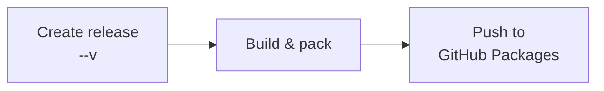
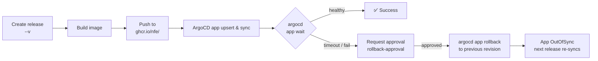
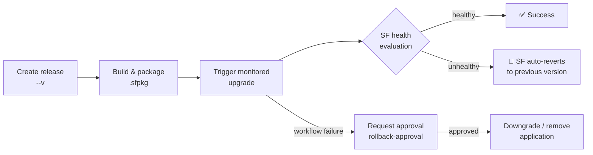

# 📘 Production repository conventions

Applies to any repo in the `nfe` organization whose artifacts ship to production — containers deployed via ArgoCD, NuGet packages published to GitHub Packages, or Service Fabric applications. Adopt these conventions when creating a new production repo or migrating an existing one.

---

# All production repositories

## 1. 🏷️ Tagging and versioning

- **Release tag prefix**: `<product>-<type>-v<semver>` (e.g., `xml2pdf-api-v1.2.0`, `nfse-worker-v3.4.1`). `<type>` is the artifact role — `api`, `worker`, `job`, `app`, etc. Always used — even when the repo ships a single artifact. Bare `v<semver>` is **not** used; the prefix keeps multi-artifact repos unambiguous and scales to additional artifacts added later without a breaking rename.
- **SemVer only** — `MAJOR.MINOR.PATCH`. The reusable workflows reject non-SemVer tags.
- **Artifact version is derived from the tag** — never hardcoded in source.

## 2. 📁 Repository layout

| Path | Purpose |
|---|---|
| `Dockerfile` | One per deployable app; multi-stage (see §4) |
| `kubernetes/values-<stage>.yaml` | Helm values per stage (container track) |
| `.github/workflows/pr.yml` | PR validation |
| `.github/workflows/publish-*.yml` | Release-triggered publish, one file per release prefix |

## 3. ⚙️ Reusable workflows

All shared reusables live in `nfe/.github/.github/workflows/`. Callers should be thin wrappers — no logic beyond input wiring and the release-prefix gate `if: startsWith(github.event.release.tag_name, '<product>-<type>-v')`. See each workflow file for its full input/secret surface.

| Workflow | Purpose |
|---|---|
| 🐳 [`build-and-push-container.yml`](https://github.com/nfe/.github/blob/main/.github/workflows/build-and-push-container.yml) | Builds a container image and pushes it to GHCR; emits the extracted version for downstream jobs. |
| 🚀 [`publish-container-argocd.yml`](https://github.com/nfe/.github/blob/main/.github/workflows/publish-container-argocd.yml) | Upserts the ArgoCD application with a given image tag, waits for healthy sync, and gates rollback via the `rollback-approval` environment. |
| 📦 [`publish-nuget.yml`](https://github.com/nfe/.github/blob/main/.github/workflows/publish-nuget.yml) | Builds, packs, and publishes a .NET project to GitHub Packages; attaches the `.nupkg` to the release. |
| 🔷 [`service-fabric-upgrade.yml`](https://github.com/nfe/.github/blob/main/.github/workflows/service-fabric-upgrade.yml) | Monitored in-place upgrade of a Service Fabric application; SF auto-reverts on health failure. |
| 🔷 [`service-fabric-recreate.yml`](https://github.com/nfe/.github/blob/main/.github/workflows/service-fabric-recreate.yml) | Tears down and recreates a Service Fabric application — for manifest changes incompatible with in-place upgrade. |
| ✅ [`validate-dotnet.yml`](https://github.com/nfe/.github/blob/main/.github/workflows/validate-dotnet.yml) | Restores, builds, and optionally tests a .NET solution on PR. |

## 4. 🐳 Dockerfile conventions

Required regardless of base image choice or language:

- **`ARG VERSION`** declared at the top; the builder stage stamps it into the artifact.
- **OCI labels** on the final stage:
  - `org.opencontainers.image.version=$VERSION`
  - `org.opencontainers.image.source=https://github.com/nfe/<repo>`
  - `org.opencontainers.image.revision=$REVISION`
- **Non-root `USER`** — declare one explicitly unless the base image already runs as non-root.
- **Multi-stage** — separate builder from runtime; runtime image carries only what's needed to run.
- **No inline versions** — toolchain version comes from a lockfile/pin file, artifact version from `ARG VERSION`.

Structure beyond these invariants (system packages, build order, layer caching) is evaluated case-by-case — only refactor when there is a concrete reason.

## 5. ⎈ Helm chart (container track)

Required values in `kubernetes/values-<stage>.yaml`:

- `image.repository: ghcr.io/nfe/<repo-name>`
- `imagePullSecrets: [{ name: "ghcr-nfe" }]` — ⚠️ **mandatory**, otherwise pods enter `ImagePullBackOff`. The `ghcr-nfe` secret is sync'd into each namespace by platform.

Everything else (probes, `ASPNETCORE_URLS`, ExternalSecrets, HPA, node selectors) is app-specific and not standardised.

## 6. 🛡️ GitHub repository settings

### 🌐 Environments

Create upfront rather than relying on GitHub's first-deploy auto-creation:

- **`<product>-<type>-<stage>`** (e.g., `xml2pdf-api-prod`) — per-deployment environment, no reviewers.

  ```bash
  gh api -X PUT repos/nfe/<repo>/environments/<product>-<type>-<stage>
  ```

- **`rollback-approval`** — shared rollback gate, one per repo. Reviewer: `Product & Engineering` team (id `963507`). `prevent_self_review: false` is intentional — on-call can approve their own rollback without paging a peer.

  ```bash
  cat <<'EOF' > /tmp/rollback-env.json
  {
    "wait_timer": 0,
    "prevent_self_review": false,
    "reviewers": [{ "type": "Team", "id": 963507 }],
    "deployment_branch_policy": null
  }
  EOF
  gh api -X PUT repos/nfe/<repo>/environments/rollback-approval --input /tmp/rollback-env.json
  ```

### 🔒 Branch ruleset

Enforce PR validation on the default branch:

```bash
gh api repos/nfe/<repo>/rulesets --method POST --input - <<'EOF'
{
  "name": "Require PR validation",
  "target": "branch",
  "enforcement": "active",
  "conditions": { "ref_name": { "include": ["~DEFAULT_BRANCH"], "exclude": [] } },
  "rules": [
    {
      "type": "required_status_checks",
      "parameters": {
        "do_not_enforce_on_create": false,
        "strict_required_status_checks_policy": true,
        "required_status_checks": [
          { "context": "pr / validate", "integration_id": 15368 }
        ]
      }
    }
  ]
}
EOF
```

### 👥 Team access

Grant `Product & Engineering` at least `write` on every production repo — environment reviewer evaluation relies on it.

## 7. 🔐 Organization-level secrets and variables

All callers inherit these org-level values — do not duplicate per repo:

| Name | Kind | Track |
|---|---|---|
| `ARGOCD_SERVER_URL` | Variable | container + ArgoCD |
| `ARGOCD_APP_NAMESPACE` | Variable | container + ArgoCD |
| `ARGOCD_PROJECT` | Variable | container + ArgoCD |
| `ARGOCD_DESTINATION_CLUSTER` | Variable | container + ArgoCD |
| `ARGOCD_AUTH_TOKEN` | Secret | container + ArgoCD |
| `SF_CLUSTER_ENDPOINT` | Variable | Service Fabric |
| `SF_CLUSTER_SERVER_CERT_THUMBPRINT` | Variable | Service Fabric |
| `SF_CLUSTER_CERT_PFX_BASE64` | Secret | Service Fabric |
| `SF_CLUSTER_CERT_PASSWORD` | Secret | Service Fabric |

## 8. 🚀 Release and rollback

### 📦 NuGet

Tag-driven. The workflow builds, packs, and publishes to GitHub Packages. Packages are immutable — there is no rollback; fix-forward with a new patch version.



### 🐳 ArgoCD (container + Kubernetes)



StatefulSets don't auto-roll-back on `ImagePullBackOff`; the `rollback-approval` gate is the only recovery path for those.

### 🔷 Service Fabric

Service Fabric's monitored upgrade handles rollback automatically via health evaluation. On health failure during the rolling upgrade, SF reverts the application to the previous version without any workflow-level gate. Workflow-level rollback (`rollback-approval`) covers the non-SF-managed cases — cert failures, package-copy failures, cluster unreachable.



---

# .NET repositories

## 📌 SDK pin

`global.json` at the repo root pins the SDK version. Match the TFM — e.g., `8.0.100` for `net8.0`.

```json
{
  "sdk": {
    "version": "8.0.100",
    "rollForward": "latestFeature"
  }
}
```

## 🏷️ Versioning

Never hardcode `<AssemblyVersion>` or `<FileVersion>` in `.csproj`. The version flows from the release tag through MSBuild via `/p:Version=<semver>`. The Dockerfile builder stage must forward `ARG VERSION` to the build: `dotnet publish ... /p:Version=${VERSION}`.

## 📦 Private packages

If the repo consumes private `nfe` NuGet packages, add this `nuget.config` at the repo root:

```xml
<?xml version="1.0" encoding="utf-8"?>
<configuration>
  <packageSources>
    <clear />
    <add key="nuget.org" value="https://api.nuget.org/v3/index.json" />
    <add key="github-nfe" value="https://nuget.pkg.github.com/nfe/index.json" />
  </packageSources>
  <packageSourceCredentials>
    <github-nfe>
      <add key="Username" value="%GITHUB_USERNAME%" />
      <add key="ClearTextPassword" value="%GITHUB_PACKAGES_TOKEN%" />
    </github-nfe>
  </packageSourceCredentials>
</configuration>
```

The `publish-nuget.yml` and `validate-dotnet.yml` reusables inject `GITHUB_USERNAME` and `GITHUB_PACKAGES_TOKEN` at restore time.

## ✅ PR validation

Call `nfe/.github/.github/workflows/validate-dotnet.yml` from `.github/workflows/pr.yml`. Tests run by default; set `skipTests: true` only when unavoidable.
